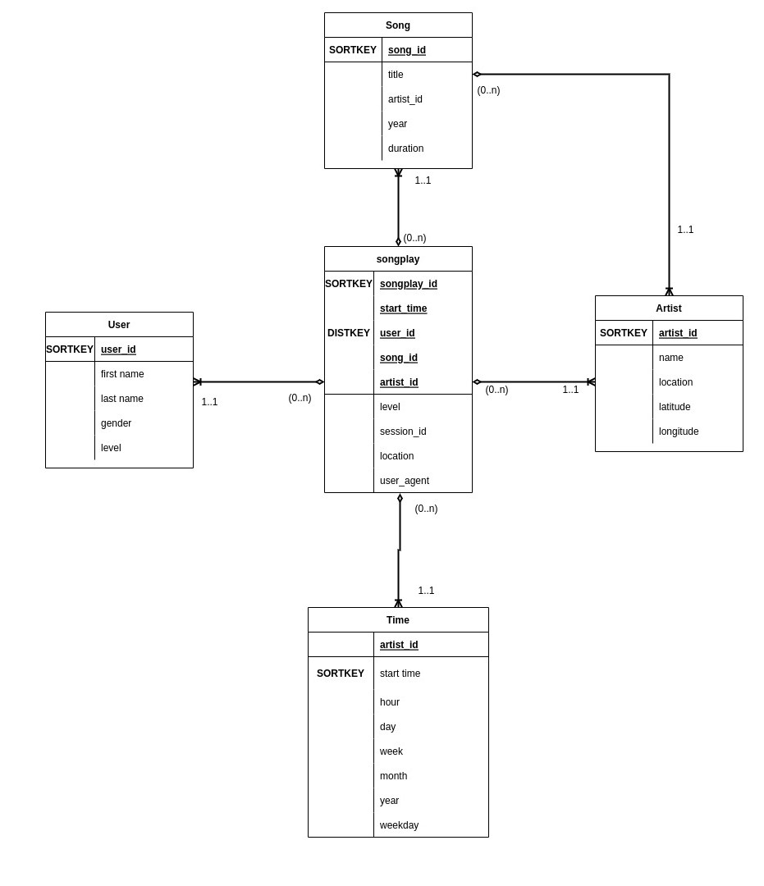

<h1>Cloud Data Warehouse</h1>
 

<h3>Overview</h3>
 

This project aims to process data from a music streaming starup called Sparkify. The data set is a collection of files in JSON format stored in an AWS S3 bucket. 
 
There are two categories of files in the S3 bucket:
<ul>
    <li><strong>s3://udacity-dend/song_data</strong>: These contain data about artists and songs.</li>
    <li><strong></strong>s3://udacity-dend/log_data</strong></li>
</ul>

 

The implements an ETL(Extract, Transform, Load) pipeline by extracting data, in JSON format, from an AWS S3 bucket, transforming it as per analytics requirement, and loading said data int AWS Redshift cluster.  

 
 
<h3>Data Modeling</h3>
 

The Sparkify analytics database is designed as a Star Schema. Hence it contains a Fact Table and four supporting dimension tables. Below is an image of the schema design:

 

